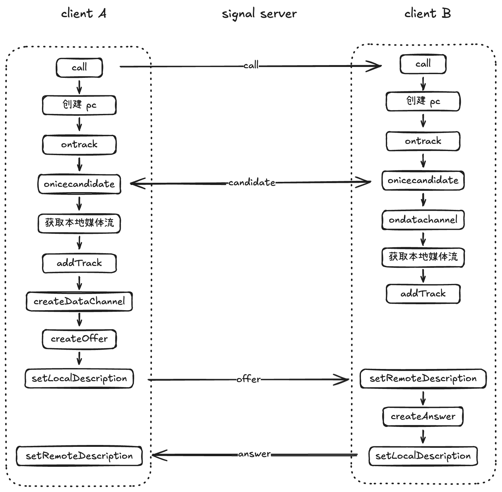
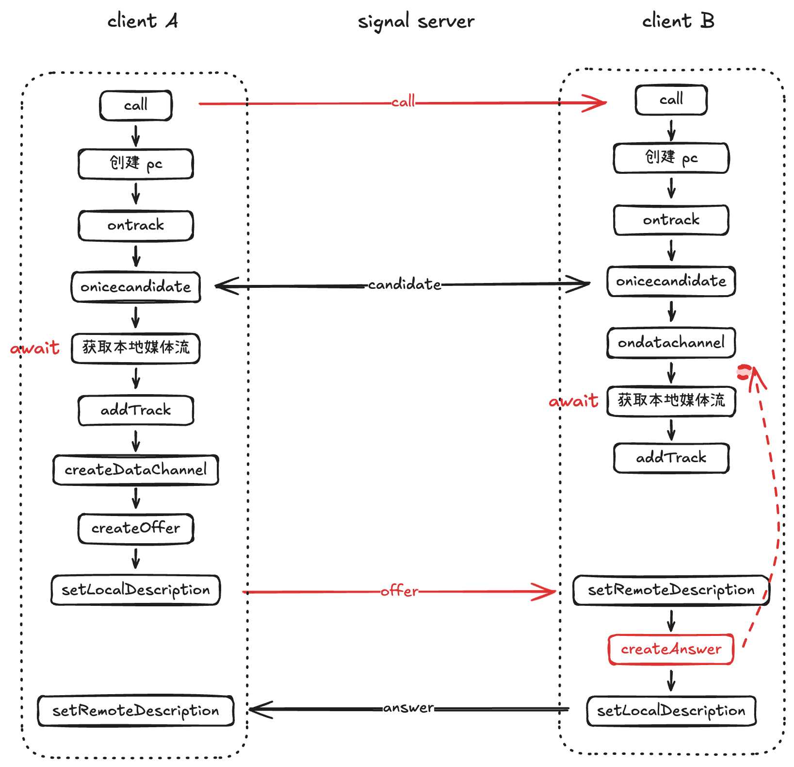

WebRTC 整个通话的载体是 PeerConnection 对象，如果没有它，则无法进行通话。

## PeerConnection 的核心方法
- createOffer(): 创建 SDP Offer（媒体协商信息），用于发起协商。
- createAnswer(): 在收到对方的 Offer 后，创建 SDP Answer（回应协商信息）。
- setLocalDescription(): 设置本地 SDP 信息并触发 ICE 收集。
- setRemoteDescription(): 设置远程 SDP 信息。
- addIceCandidate(): 添加对方发来的 ICE 候选信息（网络地址信息）此过程可能反复调用，属于连接建立阶段持续发生的动作，直到双方交换完所有候选信息。
- addTrack(): 添加本地的音频或视频轨道，使其能在 SDP 中被协商并发送给对方。
- createDataChannel(): 创建一个数据通道（DataChannel），用于在建立 P2P 后发送文本/文件等数据，无需中转服务器。

## PeerConnection 的核心事件
- ondatachannel: 创建 datachannel 后的监听回调以及 p2p 消息监听。
- ontrack: 监听远程媒体轨道，用于接收远端音视频流绑定到 <video> / <audio> 标签。
- onicecandidate: 监听 ICE 候选信息，收集到本地 ICE 候选时触发，用于将候选发送给对方（通过信令服务器转发）。

## p2p 用到的信令
- call: 主叫通知被叫“有人呼叫你”，主要用于邀请对方建立通信，并不包含媒体协商信息。
- offer: 主叫发送自己的 SDP 配置信息（即媒体协商参数）给被叫。
- answer: 被叫在收到 offer 后创建 SDP 回应信息发送给主叫。
- candidate: 双方在网络打洞阶段不断收集 ICE 候选，当收到对方 candidate 后，调用 addIceCandidate 添加到自己的 candidate 列表，用于建立实际的 P2P 连接。

## 会话流程图



## 创建 datachannel 时注意点
**DataChannel 只能由主叫创建，被叫应该通过 pc.ondatachannel 自动接收，而不能再次主动创建。**

```ts
function setupDataChannel(channel: RTCDataChannel) {
  channel.onmessage = (e) => {
    console.log('收到消息', e.data)
  }
  channel.onopen = () => console.log('dataChannel 建立成功')
  channel.onclose = () => console.log('dataChannel 已关闭')
}

// 主叫
chatChannel = pc.createDataChannel('chat')
setupDataChannel(chatChannel)

// 被叫
pc.ondatachannel = (e) => {
  chatChannel = e.channel
  setupDataChannel(chatChannel)
}
```

## 坑点
### WebRTC连接已建立但是主叫却没有收到被叫的媒体流

**现象**:  
WebRTC 的连接已建立，但是主叫的 ontrack 没有被触发。

**产生原因**:  

1. 主叫发送 call 信令，同时开始执行一系列操作；被叫收到 call 信令后，也开始一系列操作。这些操作都是**同步**进行的。
2. 主叫整体执行的速度快，创建 offer 之后又向被叫发送了 offer 信令，被叫收到之后执行了 setRemoteDescription 和 createAnswer。
3. 被叫在收到 offer 信令的时候，本地获取媒体流这一步还没有执行完成，也就还没有执行 addTrack；这就导致了 **createAnswer 早于 adTrack**，而 WebRTC 要求: 在整个建立连接的过程中，必须 **先 addTrack**，**再 createOffer / createAnswer**。



**总结**:

在整个建立连接的过程中，必须 **先 addTrack**，**再 createOffer / createAnswer**。
